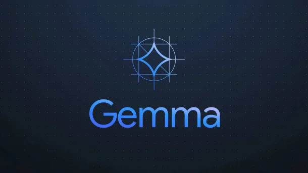
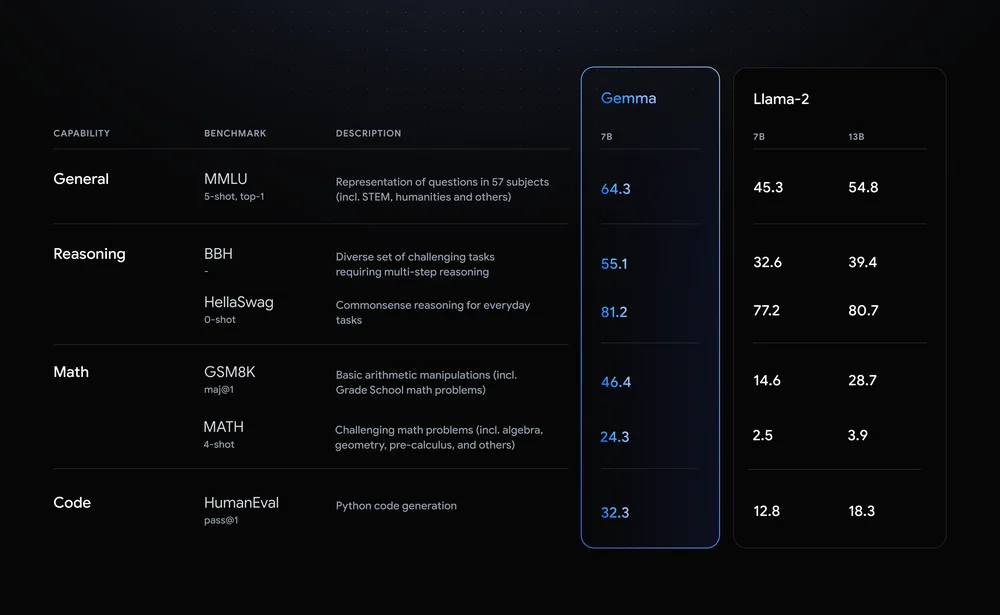

# Gemma

## What is Gemma?

Gemma is a family of lightweight, state-of-the-art, open-source AI models developed by Google AI. They are designed specifically for developers and researchers to make it easier for them to get started with AI while promoting responsible AI development.

## Why use Gemma?

